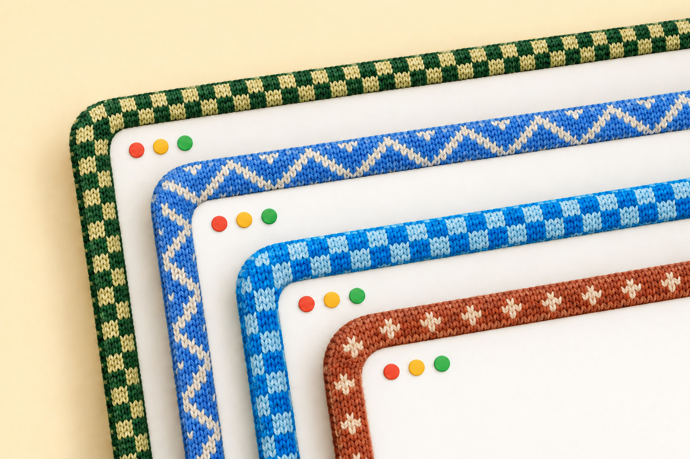

# Window Sweaters

A small native macOS menu-bar app that dresses your windows in knitted borders.
Procedurally rendered yarn, app-inspired colourways, and a little warmth for your desktop.



## Install

Download `WindowSweaters-<version>.zip` from [Releases](../../releases), unzip it, and move
**Window Sweaters.app** to your Applications folder.

The app is ad-hoc signed rather than notarized by Apple, so macOS blocks it on the
first launch. To allow it:

1. Double-click the app. macOS refuses to open it.
2. Open **System Settings → Privacy & Security**, scroll to Security, and click
   **Open Anyway** for Window Sweaters.
3. Confirm. The choice is remembered, and later launches open normally.

On macOS 15 and later, Control-clicking the app no longer bypasses this, so the
Privacy & Security step is the supported route. From Terminal,
`xattr -dr com.apple.quarantine "/Applications/Window Sweaters.app"` has the same
effect before the first launch.

The download is a universal binary covering Apple Silicon and Intel Macs. The app
declares macOS 13 as its minimum; hands-on development has been on Apple Silicon and
macOS 26. The Intel slice compiles and links but has not been run on Intel hardware,
and compatibility with every supported macOS version is not verified.

## Using it

Open the yarn icon in the menu bar to change patterns, border width and stitch
size, pause sweaters, or quit. New installations use **12 pt borders**, six stitch
rows, and **Pattern → By App**. Your saved choices take precedence.

If macOS requests Accessibility access, enable the app in System Settings →
Privacy & Security → Accessibility. That permission supports focus detection;
this app does not need Full Disk Access.

## Build from source

Requires Apple's Command Line Tools (`xcode-select --install`).

```sh
./scripts/build-app.sh
python3 scripts/install-local.py
```

The build creates `outputs/Window Sweaters.app`. The installer puts one copy in
`~/Applications/Window Sweaters.app` and opens it. It replaces only this app or
its previous **Knit Borders** installation, with a backup in the temporary folder.
Local builds are ad-hoc signed, not Developer ID signed or notarized.

## Sweaters


Eight favourite apps, each shown in **By App** and **Zigzag**, straight from the
renderer at 12 pt. The [collection catalogue](docs/COLLECTION.md) shows all 36 app colourways and
close-up yarn details. Unknown apps receive a consistent fallback colour; the
app does not extract colours from icons. App names identify the inspiration and
do not imply affiliation or endorsement.

The monochrome [yarn icon](assets/yarn-menu-icon.svg) uses a native AppKit template
so its tint follows the menu bar's appearance.

## Current limitations

This is an experimental desktop utility. Window tracking uses private SkyLight
APIs, which may change between macOS releases. Borders deliberately hide during
resizing and reappear when the window settles. Movement, stacking, display
transfers and window lifecycles have automated coverage, but that does not
establish perfect behaviour in every app, Space or display arrangement.

## Personal colourways

Advanced customisation is file-based for now. Edit the files below, then restart
the app to load your changes.
For compatibility, custom files remain in:

```text
~/Library/Application Support/Knit Borders/apps.conf
~/Library/Application Support/Knit Borders/charts/
```

Example rule:

```text
Claude = #D58561 atelier-claude
```

Rules match process-name prefixes, case-insensitively; the longest matching rule
wins. PNG charts can override built-in patterns. Built-ins need no external files.
Your personal configuration is not included in this repository.

## Development

```sh
make test       # renderer, collection, tracking, lifecycle, focus and menu checks
make catalogue  # regenerate the visual catalogue from the native renderer
make bench     # renderer benchmark
```

See [CONTRIBUTING.md](CONTRIBUTING.md) for testing and compatibility conventions.

## Credits and license

Built on [JankyBorders](https://github.com/FelixKratz/JankyBorders) by Felix Kratz.
This project retains the existing [GNU GPL v3 license](LICENSE).
See [NOTICE.md](NOTICE.md) for attribution.
